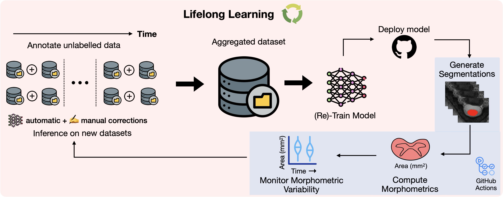

# Towards Contrast-agnostic Soft Segmentation of the Spinal Cord

[](https://doi.org/10.1016/j.media.2025.103473)
[](https://doi.org/10.1162/IMAG.a.1105)

Official repository for contrast-agnostic segmentation of the spinal cord. 

This repo contains all the code for training the contrast-agnostic model. The code for training is based on the [nnUNetv2 framework](https://github.com/MIC-DKFZ/nnUNet). The segmentation model is available as part of [Spinal Cord Toolbox (SCT)](https://spinalcordtoolbox.com/stable/user_section/command-line/deepseg/spinalcord.html) via the `sct_deepseg` functionality.


### Citation Information

If you find this work and/or code useful for your research, please cite our papers:

```
@article{BEDARD2025103473,
title = {Towards contrast-agnostic soft segmentation of the spinal cord},
journal = {Medical Image Analysis},
volume = {101},
pages = {103473},
year = {2025},
issn = {1361-8415},
doi = {https://doi.org/10.1016/j.media.2025.103473},
url = {https://www.sciencedirect.com/science/article/pii/S1361841525000210},
author = {Sandrine Bédard* and Enamundram Naga Karthik* and Charidimos Tsagkas and Emanuele Pravatà and Cristina Granziera and Andrew Smith and Kenneth Arnold {Weber II} and Julien Cohen-Adad},
note = {Shared authorship -- authors contributed equally}
}
```

```
@article{Karthik2026,
title = {Monitoring morphometric drift in lifelong learning segmentation of the spinal cord},
journal = {Imaging Neuroscience},
volume = {4},
pages = {IMAG.a.1105},
year = {2026},
doi = {https://doi.org/10.1162/IMAG.a.1105},
author = {Enamundram Naga Karthik and Sandrine Bédard and Jan Valošek and Christoph S Aigner and Elise Bannier and Josef Bednařík and Virginie Callot and Anna Combes and Armin Curt and Gergely David and Falk Eippert and Lynn Farner and Michael G Fehlings and Patrick Freund and Tobias Granberg and Cristina Granziera and Ulrike Horn and Tomáš Horák and Suzanne Humphreys and Markus Hupp and Anne Kerbrat and Nawal Kinany and Shannon Kolind and Petr Kudlička and Anna Lebret and Lisa Eunyoung Lee and Caterina Mainero and Allan R Martin and Megan McGrath and Govind Nair and Kristin P O'Grady and Jiwon Oh and Russell Ouellette and Nikolai Pfender and Dario Pfyffer and Pierre-François Pradat and Alexandre Prat and Emanuele Pravatà and Daniel S Reich and Ilaria Ricchi and Naama Rotem-Kohavi and Simon Schading-Sassenhausen and Maryam Seif and Andrew Smith and Seth A Smith and Grace Sweeney and Roger Tam and Anthony Traboulsee and Constantina Andrada Treaba and Charidimos Tsagkas and Zachary Vavasour and Dimitri Van De Ville and Kenneth Arnold Weber II and Sarath Chandar and Julien Cohen-Adad}
}
```




## Table of contents
* [Training the model ](#training-the-model)
* [Lifelong learning for monitoring morphometric drift](#lifelong-learning-for-monitoring-morphometric-drift)

<!-- * [5. Computing morphometric measures (CSA)](#5-computing-morphometric-measures-csa)
    * [5.1. Using contrast-agnostic model (best)](#51-using-contrast-agnostic-model-best)
    * [5.2. Using nnUNet model](#52-using-nnunet-model)
* [6. Analyse CSA and QC reports](#6-analyse-csa-and-qc-reports)
* [7. Get QC reports for other datasets](#7-get-qc-reports-for-other-datasets)  
    * [7.1. Running QC on predictions from SCI-T2w dataset](#71-running-qc-on-predictions-from-sci-t2w-dataset)
    * [7.2. Running QC on predictions from MS-MP2RAGE dataset](#72-running-qc-on-predictions-from-ms-mp2rage-dataset)
    * [7.3. Running QC on predictions from Radiculopathy-EPI dataset](#73-running-qc-on-predictions-from-radiculopathy-epi-dataset) -->


## Training the model 

### Step 1: Configuring the environment

1. Create a conda environment:
```bash
conda create -n contrast_agnostic_310 python=3.10
conda activate contrast_agnostic_310
```

2. Clone the repository (sc-crop-v4 branch):
```bash
git clone https://github.com/quentinRevillon/contrast-agnostic-softseg-spinalcord.git --branch sc-crop-v4
cd contrast-agnostic-softseg-spinalcord
```

3. Install the required packages (includes nnUNet and PyTorch):
```bash
pip install -r nnUnet/requirements.txt
```

> **Note**
> `requirements.txt` pins nnUNet to a specific GitHub commit (v2.6.0) compatible with PyTorch 2.8+cu128. PyTorch 2.8 is required for Blackwell GPUs (sm_120, e.g. RTX PRO 6000). PyPI `nnunetv2==2.5.2` is broken with PyTorch>=2.4 due to a removed `verbose` parameter in `_LRScheduler`.


## Run inference of a trained segmentation model with cropping

All steps below are copy-paste ready and have been tested end-to-end.

### Step 1: Set up the environment

```bash
conda create -n sc_crop python=3.10 -y
conda activate sc_crop
pip install \
    "sc-crop @ git+https://github.com/ivadomed/sc-crop.git@v0.4.1" \
    "nnunet-onnx @ git+https://github.com/quentinRevillon/nnunet-onnx.git" \
    torch nnunetv2 onnxscript onnx
```

### Step 2: Download the example image and the v4.1 model

```bash
mkdir ~/ca-inference-test && cd ~/ca-inference-test

# Example T2w image (from sc-crop test data)
curl -L https://github.com/ivadomed/sc-crop/releases/download/test-data/t2.nii.gz -o t2.nii.gz

# v4.1 model
curl -L https://github.com/quentinRevillon/contrast-agnostic-softseg-spinalcord/releases/download/v4.1/model_contrast_agnostic_20260602.zip -o model_v4.zip
unzip model_v4.zip
```

### Step 3: Convert v4.1 checkpoint to ONNX

```bash
python -m nnunet_onnx.export \
    --checkpoint nnUNetTrainer__nnUNetPlans__3d_fullres/fold_0/checkpoint_best.pth \
    --output model_contrast_agnostic_v4.1.onnx
```

### Step 4: Run inference — v4.1 model

```bash
# PyTorch
sc-segment-pt \
    -i t2.nii.gz -o seg_v4_pt.nii.gz \
    --checkpoint nnUNetTrainer__nnUNetPlans__3d_fullres/fold_0/checkpoint_best.pth

# ONNX (no nnUNet at runtime)
sc-segment-onnx \
    -i t2.nii.gz -o seg_v4_onnx.nii.gz \
    --model model_contrast_agnostic_v4.1.onnx
```

### Step 5: Run inference — v3.0 model via SCT (requires SCT installed)

`sct_deepseg spinalcord` uses the v3.0 contrast-agnostic model bundled in SCT — no separate download needed.

```bash
sct_deepseg spinalcord -i t2.nii.gz -o seg_sct.nii.gz
```

### Visualise all results

```bash
fsleyes t2.nii.gz seg_sct.nii.gz -cm red seg_v4_pt.nii.gz -cm blue seg_v4_onnx.nii.gz -cm green &
```

> **Benchmark results** (Intel i7-11370H @ 3.30GHz, 11 GB RAM, CPU only) are documented in [issue #2](https://github.com/quentinRevillon/contrast-agnostic-softseg-spinalcord/issues/2): `sc-segment-onnx` is ~10× faster than `sct_deepseg spinalcord` on the same image.

> Dice results on the test set (v4.1 vs v3.0) are documented in [issue #5](https://github.com/quentinRevillon/contrast-agnostic-softseg-spinalcord/issues/5).

### Training the model

The script `scripts/train_contrast_agnostic.sh` downloads the datasets from git-annex, creates datalists, converts them into nnUNet-specific format, and trains the model. More instructions about what variables to set and which datasets to use can be found in the script itself. Once these variables are set, run:

```bash
bash scripts/train_contrast_agnostic.sh
```

> [!IMPORTANT]  
> The script `train_contrast_agnostic.sh` will NOT run out-of-the-box. User-specific variables such as the path to download datasets and nnUnet repository need to be set. Info about which varibles to set can be found in the script itself.

> [!IMPORTANT]  
 > You might need to run the `train_contrast_agnostic.sh` script in a virtual terminal such as `tmux` or `screen`.

### Step 3: Evaluate on the test set

Once training is complete, run inference on the test set and compute Dice scores:

```bash
bash scripts/test_contrast_agnostic.sh
```

By default uses `checkpoint_best.pth`. Results are saved in:
`nnUNet_results/Dataset4000_ContrastAgnosticScCrop/nnUNetTrainer__nnUNetPlans__3d_fullres/predictions_test_fold0_checkpoint_best/summary.json`

To use the final checkpoint instead:
```bash
CHECKPOINT=checkpoint_final.pth bash scripts/test_contrast_agnostic.sh
```

> Dice results for this branch are documented in [issue #5](https://github.com/quentinRevillon/contrast-agnostic-softseg-spinalcord/issues/5).
<!-- 
TODO: move to csa_qc_evaluation folder
## 5. Computing morphometric measures (CSA)

To compute the CSA at C2-C3 vertebral levels on the prediction masks and get the QC report of the predictions, the script `compute_csa_qc_<nnunet/monai>.sh` are used. The input is the folder `data_processed_clean` (result from preprocessing) and the path of the prediction masks is added as an extra script argument `-script-args`.
  
For every trained model, you can run:

```
sct_run_batch -jobs -1 -path-data /data_processed_clean/ -path-output <PATH_OUTPUT> -script compute_csa_qc_<nnunet/monai>.sh -script-args <PATH_PRED_MASKS>
```
* `-path-data`: Path to data from spine generic used for training.
* `-path-output`: Path to save results
* `-script`: Script to compute the CSA and QC report
* `-script-args`: Path to the prediction masks

The CSA results will be under `<PATH_OUTPUT>/results` and the QC report under `<PATH_OUTPUT>/qc`.

### 5.1. Using contrast-agnostic model (best)
Here is an example on how to compute CSA and QC on contrast-agnostic model

```
sct_run_batch -jobs -1 -path-data ~/duke/projects/ivadomed/contrast-agnostic-seg/data_processed_sg_2023-03-10_NO_CROP\data_processed_clean -path-output ~/results -script compute_csa_qc_monai.sh -script-args ~/duke/projects/ivadomed/contrast-agnostic-seg/models/monai/spine-generic-results
```

### 5.2. Using nnUNet model
 **Note:** For nnUnet, change the variable `prefix` in the script `compute_csa_nnunet.sh` according to the prefix in the prediction name.
Here is an example on how to compute CSA and QC on nnUNet models.

```
sct_run_batch -jobs -1 -path-data ~/duke/projects/ivadomed/contrast-agnostic-seg/data_processed_sg_2023-03-10_NO_CROP\data_processed_clean -path-output ~/results -script compute_csa_qc_nnunet.sh -script-args ~/duke/projects/ivadomed/contrast-agnostic-seg/models/nnunet/spine-generic-results/test_predictions_2023-08-24
``` 

TODO: Move to csa_generate_figures folder
## 6. Analyse CSA and QC reports
To generate violin plots and analyse results, put all CSA results file in the same folder (here `csa_ivadomed_vs_nnunet_vs_monai`) and run:

```
python analyse_csa_all_models.py -i-folder ~/duke/projects/ivadomed/contrast-agnostic-seg/csa_measures_pred/csa_ivadomed_vs_nnunet_vs_monai/ \
                                 -include csa_monai_nnunet_2023-09-18 csa_monai_nnunet_per_contrast csa_gt_2023-08-08 csa_gt_hard_2023-08-08 \
                                          csa_nnunet_2023-08-24 csa_other_methods_2023-09-21-all csa_monai_nnunet_2023-09-18_hard csa_monai_nnunet_diceL
```
* `-i-folder`: Path to folder containing CSA results from models to analyse
* `-include`: names of the folder names to include in the analysis (one model = one folder)

The plots will be saved to the parent directory with the name `charts_<datetime.now())>` -->


## Lifelong learning for monitoring morphometric drift

This section provides some notes on the lifelong/continuous learning framework for automatically monitoring morphometric drift between various versions of segmentation models. Once a new segmentation model is developed and released, a GitHub actions (GHA) workflow is triggered which automatically computes the spinal cord CSA between current (new) version of the model and previously released models. 

For a fair comparison, we evalute various model versions on the frozen test set of the spine-generic `data-multi-subject` (public) dataset. The test split can be found in `scripts/spine_generic_test_split_for_csa_drift_monitoring.yaml` file. 

### Step 1: Creating a new release

Here are the steps involved in the workflow:

* After training a new segmentation model, create a release with the following naming convention: 
    * **Tag name**: `vX.Y` (e.g. `v2.0`, `v3.0`, etc.), where `X` is the major update (i.e. architectural/training-strategy change) and `Y` is the minor update (addition of new contrasts and/or pathologies).
    * **Release title**: `contrast-agnostic-spinal-cord-segmentation vX.Y` (note, the title can be anything, GHA workflow does not depend on it).
    * **Release description**: A drop-down summary of the dataset characteristics. The details of the datasets used during training is automatically generated from the `nnUnet/utils.py` script.
    * **Release assets**: The model weights and the training logs (if needed) are attached to the release. The entire output folder of the nnUnet model containing the folds, should be uploaded. The naming convention for the `.zip` file should be `model_contrast_agnostic_<date-the-model-was-trained-on>.zip`. 
    * Once the above steps are completed, publish the release.

### Step 2: The GHA workflow

* Once published, the release triggers a GHA workflow. The workflow is a `.yml` file located in the `.github/workflows` folder. For a high-level overview, it is divided into the following steps:
    * **Job 1**: Clones the dataset via git-annex and only downloads subjects in the test split. The dataset is cached for future use.
    * **Job 2**: The test set of *(n=49)* is split into batches of 3 subjects for parallel processing. The model is downloaded from the release and each job (or, a runner) is responsible for computing the C2-C3 CSA for all the 6 contrasts. 
    * **Job 3**: The output `.csv` files are aggregated across batches and merged into a single CSV file. The file is saved with the following naming convention `csa_c2c3__model_<tag-name>.csv` (note that the tag name defined in Step 1 is being used here) and uploaded to the release.
    * **Job 4**: All `csa_c2c3__model_<tag-name>.csv` files corresponding to current and previous releases are downloaded. Then, violin plots comparing the CSA per contrast (for each model) and the STD of CSA across contrasts are generated. The plots are saved in the `morphometric_plots.zip` folder and uploaded to the existing release.

In summary, once a new model is released, the GitHub actions workflow automatically generates the plots for monitoring the morphometric drift between various versions of the segmentation model.
